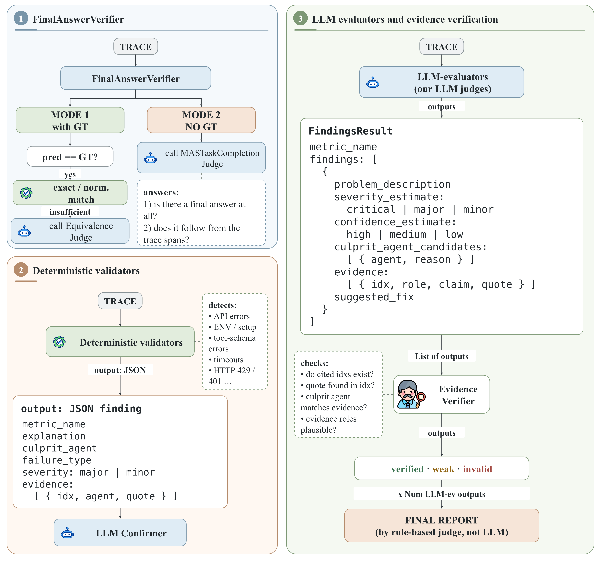
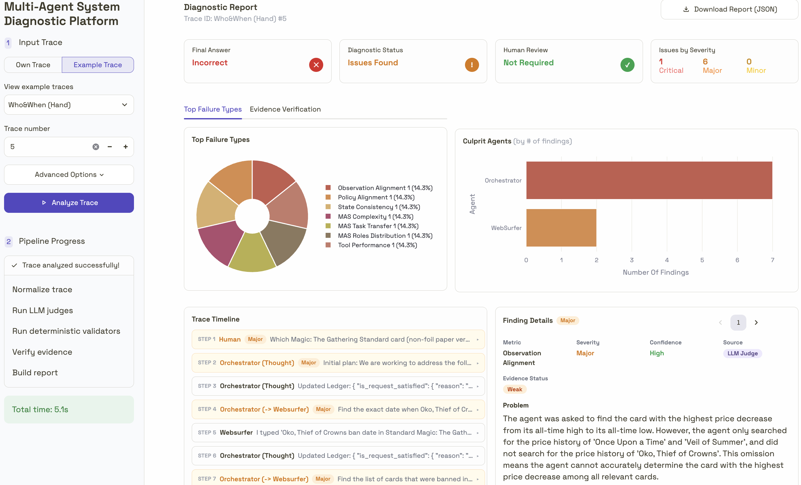

# TraceInspector (MASeval)

**TraceInspector** is a modular framework for diagnosing *why* LLM-based multi-agent systems fail — not just whether they failed.

Instead of a single general-purpose LLM-as-a-Judge prompt, TraceInspector combines:

- **eleven specialized LLM judges** for semantic failures (reasoning, coordination, tool and prompt use);
- **deterministic (non-LLM) validators** for objective runtime failures (API/HTTP, provider, environment, tool-schema);
- an optional **LLM Confirmer** that screens deterministic findings against the trace and appoints the causal agent turn;
- a deterministic **EvidenceVerifier** that checks whether every LLM finding is actually grounded in the trace;
- a rule-based **report builder** that merges all branches into one structured diagnostic report.

The framework is implemented in the **MASeval** repository (Python package `maseval`) and works across heterogeneous trace formats and evaluation benchmarks.

<p align="center">
  
</p>
<p align="center"><em>TraceInspector aggregates final-answer verification, non-LLM runtime validation (optionally screened by the Confirmer), and eleven specialized LLM judges into one provenance-aware report.</em></p>

---

## 🌐 Online Demo

A live version of TraceInspector is available on Hugging Face Spaces:

👉 **Demo:** https://huggingface.co/spaces/jrzkaminski/masque-dashboard
🎬 **Video walkthrough:** https://youtu.be/dy_5b-i2vc0

- **Example Trace** — explore precomputed diagnostic reports without any API key;
- **Own Trace** — upload your own trace and run API-backed analysis.

<p align="center">
  
</p>
<p align="center"><em>The dashboard links the status summary and culprit distribution to the timeline and finding inspector. Selecting a finding opens its diagnosis together with cited evidence, source, confidence, verification status, and a suggested fix.</em></p>

The hosted UI is a demonstration frontend; the core diagnostic package in this repository installs and runs locally (see [Installation](#installation)).

---

## Why TraceInspector?

A final success/failure score is not enough for debugging a multi-agent system. Developers usually need to know:

- **which agent** introduced the failure;
- **where** the first problematic step occurred;
- whether the failure originated from **reasoning, coordination, tool use, an API, or the environment**;
- what **evidence in the trace** supports the diagnosis;
- **how the system can be fixed**.

TraceInspector answers these questions with structured, evidence-linked findings instead of a scalar score.

---

## System Overview

TraceInspector runs three diagnostic branches and aggregates their outputs into one report.

### 1. Final Answer Verification

`maseval.evaluation_blocks.final_answer_verification.FinalAnswerVerifier` determines whether the system solved the original task, using a cascade of methods:

- **`direct_comp`** — exact comparison of the extracted final answer against a reference answer, when one is available;
- **`equivalence_judge`** — an LLM equivalence check when the answer and reference differ textually;
- **`mtc_judge`** — a task-completion judge over the full trace (**no-GT mode**), used when no ground truth or no extractable final answer exists.

Every method returns a normalized `FinalAnswerVerificationResult` with an `ideal`/`poor` verdict, a confidence level, and the method used. The experiments in the accompanying paper use the **no-GT setting**: the diagnostic components never see the benchmark ground truth, which is used only for offline metric computation.

### 2. Deterministic (non-LLM) Validation

Rule-based validators (`maseval.validators`) detect failures that can be read directly from execution logs, with no LLM calls and zero cost:

| Validator | Detects |
|---|---|
| `ApiHttpValidator` | failed HTTP requests, empty API responses, rate limits |
| `ProviderValidator` | LLM-provider errors, context-limit violations |
| `EnvironmentSetupValidator` | missing credentials/dependencies/files, permission errors |
| `ToolSchemaValidator` | invalid tool arguments, malformed outputs, schema violations |

Run them on a trace, file, or directory via `run_on_trace` / `run_on_file` / `run_on_dir`. Overlapping matches from different validators are deduplicated, and findings are emitted in the same structured format as LLM findings.

**LLM Confirmer (optional).** Deterministic findings can be passed through `maseval.validators.llm_confirm`, a thin opt-in LLM layer that does two things regex structurally cannot:

1. **Confirmation** — labels each finding `confirmed` / `benign` / `uncertain` by reading the surrounding trace context (e.g. distinguishing a *silent failure* — empty tool result the agent needed — from a benign empty result);
2. **Appointing** — names the agent *decision turn* that caused the failure (`corrected_idx`), separate from the span where the error text surfaced.

The Confirmer is **non-destructive**: it never drops or rewrites deterministic findings; its verdict is attached under `finding["llm_confirmation"]` and downstream code decides how to use it.

### 3. Specialized LLM Judges

Semantic diagnosis is decomposed into **eleven** specialized LLM judges:

| Judge | `MetricType` |
|---|---|
| Observation Alignment | `OBSERVATION_ALIGNMENT` |
| Policy Alignment | `POLICY_ALIGNMENT` |
| State Consistency | `STATE_CONSISTENCY` |
| Tool Selection | `TOOL_SELECTION` |
| Tool Parameter Extraction | `TOOL_PARAMETER_EXTRACTION` |
| Multi-Agent Planning | `MAS_PLANNING` |
| Multi-Agent Complexity | `MAS_COMPLEXITY` |
| Multi-Agent Task Transfer | `MAS_TASK_TRANSFER` |
| Multi-Agent Role Distribution | `MAS_ROLES_DISTRIBUTION` |
| Tool Performance | `TOOL_PERFORMANCE` |
| Prompt Quality | `PROMPT_QUALITY` |

Each judge analyzes one narrow diagnostic dimension, which makes the output easier to inspect and compare than a single monolithic judge response. Judges are instantiated through the metric factory and return typed Pydantic results:

```python
from maseval.metrics import MetricType, create_metric
from maseval.models import RawTraceInput

metric = create_metric(MetricType.MAS_TASK_TRANSFER, model)
result = await metric.evaluate(RawTraceInput(trace=trace_text))
```

The factory also provides supplementary metrics not used in the findings pipeline: `TASK_COMPLETENESS`, `MAS_TASK_COMPLETION` (backs the no-GT final-answer judge), and non-LLM performance metrics (`TOOL_EFFICIENCY`, `MAS_TIME`, `MAS_TOKENS`, `AGENT_TIME`, `AGENT_TOKENS`).

---

## Structured Findings

Every LLM judge returns a `MetricResult` with zero or more structured findings (`maseval.models.Finding`):

```json
{
  "metric_name": "mas_task_transfer",
  "findings": [
    {
      "severity_estimate": "critical",
      "confidence_estimate": "high",
      "culprit_agent_candidates": [
        {
          "agent": "ExhibitionContentAnalyzer",
          "reason": "This agent introduced the unsupported claim that was passed downstream."
        }
      ],
      "evidence": [
        {
          "idx": "17",
          "role": "root_cause",
          "claim": "The agent introduced an unsupported claim.",
          "quote": "No exhibited zodiac animals have visible hands."
        },
        {
          "idx": "24",
          "role": "propagation",
          "claim": "A downstream agent relied on the unsupported claim.",
          "quote": "Since no animals have visible hands, image retrieval is unnecessary."
        }
      ],
      "problem_description": "An unsupported factual handoff caused a downstream agent to skip a required step.",
      "suggested_fix": "Require downstream agents to validate factual handoffs before skipping required tools.",
      "needs_human_review": false
    }
  ]
}
```

`evidence[i].idx` points at a concrete trace item: a zero-based message/step index for raw traces, or a stable `state_id` / `response_id` / tool-call id when the trace exposes them.

The report builder (`maseval.reporting.build_evaluation_report`) merges findings from all enabled components into a single diagnostic report containing the answer status, severity counts, the primary culprit agent and failure type, problematic steps, supporting evidence, review targets, and suggested fixes. A weighted variant (`maseval.reporting_weighted`) allows down-weighting non-LLM validator findings in the aggregation.

---

## Evidence Verification

LLM findings are processed by a lightweight deterministic verifier, `maseval.metrics.EvidenceVerifier`. It does **not** judge semantic correctness — only whether a finding is grounded in the provided trace:

- do the cited `idx` values exist in the trace?
- can the quoted evidence be found at the cited locations?
- is the culprit-agent attribution compatible with the cited evidence?
- are the evidence roles plausible?

Each finding receives one of three labels: **`verified`**, **`weak`**, or **`invalid`**, plus per-evidence-item diagnostics explaining which concrete citation failed.

The report builder and evaluation scripts support three gating policies (`verifier_mode`):

- **`none`** — every LLM finding counts;
- **`soft`** *(default)* — `verified` and `weak` findings count; `invalid` findings are excluded from the main diagnosis and kept as review targets;
- **`strict`** — only `verified` findings count.

`examples/who_and_when/verifier_ablation.py` rebuilds the same predictions under all three policies for comparison. In the paper's experiments, automatic filtering is kept off for the main results because it reduced localization accuracy with Gemini 2.5 Flash; verification labels are still attached to every finding in the report.

---

## Supported Evaluation Benchmarks

The repository contains benchmark-specific adapters and evaluation scripts under `examples/`:

| Benchmark | Directory | Reported metrics |
|---|---|---|
| **Who&When** (Hand-Crafted + Algorithm-Generated) | `examples/who_and_when/` | Agent Accuracy, Step Accuracy |
| **TRAIL** (GAIA) | `examples/trail/` | Localization Accuracy |
| **AEGIS** | `examples/aegis/` | agent-level attribution (top-1 / hit / exact-set) |
| **AgentRx** (*TraceElephant* in the paper) | `examples/agentrx/` | Agent Accuracy, Step Accuracy |

Benchmark ground truth is used only for offline metric computation — it is never shown to the diagnostic judges.

### Results (from the accompanying paper)

Controlled Who&When comparison, all LLM configurations on Gemini 2.5 Flash (A/S = Agent/Step Accuracy, H/A = Hand-Crafted/Algorithm-Generated):

| Configuration | WW Hand A/S | WW Algo A/S | Mean LLM $/trace H/A |
|---|---|---|---|
| Reproduced Who&When judge (all-at-once) | 58.62 / 3.45 | **66.67** / 28.57 | 0.018 / 0.004 |
| Non-LLM validators | 32.76 / 12.07 | 3.17 / 4.76 | 0 / 0 |
| Specialized LLM judges | **60.30** / 36.21 | 46.80 / 34.10 | 0.123 / 0.029 |
| Full TraceInspector | **60.30** / **39.70** | 49.20 / **47.60** | 0.126 / 0.030 |

Breadth results under the official benchmark protocols (original judges use their published backbones):

| Benchmark | Primary metric | Original judge | TraceInspector |
|---|---|---|---|
| TRAIL | Localization Acc. | 17.05 | **20.20** |
| AEGIS | Agent MF1 | 16.45 | **30.32** |
| TraceElephant | Step Acc. | 27.6 | **51.8** |

---

## Installation

Requires **Python ≥ 3.12**.

### Using `uv` (recommended)

```bash
git clone https://github.com/sb-ai-lab/MASeval.git
cd MASeval
uv sync
```

### Using `pip`

```bash
git clone https://github.com/sb-ai-lab/MASeval.git
cd MASeval
pip install -e .
```

The package installs as `maseval-research` and is imported as `maseval`.

---

## Environment Variables

The example runners call models through **OpenRouter** (via `pydantic-ai`'s `OpenAIChatModel` with `provider="openrouter"`), so the one required variable is:

```bash
export OPENROUTER_API_KEY="sk-or-..."
# optional, defaults to the public OpenRouter endpoint:
export OPENROUTER_BASE_URL="https://openrouter.ai/api/v1"
```

A `.env` file next to the script you run is picked up automatically (`python-dotenv`).

### Optional Langfuse configuration

MASeval uses **two separate Langfuse clients** so that source traces and evaluation (judge) traces stay isolated — see [LANGFUSE_SETUP.md](LANGFUSE_SETUP.md) for the full guide and [TRACE_GROUPING.md](TRACE_GROUPING.md) for how evaluations are grouped per task:

```bash
# Download client — the project your source traces live in
export LANGFUSE_PUBLIC_KEY="pk-lf-..."
export LANGFUSE_SECRET_KEY="sk-lf-..."
export LANGFUSE_HOST="https://cloud.langfuse.com"

# Judge client — the project judge/evaluation traces are uploaded to
export LANGFUSE_PUBLIC_KEY_JUDGE="pk-lf-..."
export LANGFUSE_SECRET_KEY_JUDGE="sk-lf-..."
export LANGFUSE_HOST_JUDGE="https://cloud.langfuse.com"
```

Langfuse is optional: the benchmark launchers accept `enable_tracing=False` to run without it.

### Tuning knobs

| Variable | Default | Meaning |
|---|---|---|
| `FROM_IDX` | `0` | resume a benchmark run from this task index |
| `METRIC_TIMEOUT` | `600` | per-metric LLM call timeout, seconds |
| `MTC_JUDGE_TIMEOUT` | `600` | timeout for the no-GT task-completion judge |
| `MAX_OUTPUT_TOKENS` | `4096` | output-token cap in the AgentRx runner |
| `PROMPTS_LANG` | `ENG` | judge prompt language |

---

## Running the Pipeline

A typical workflow:

1. convert a benchmark trace into the MASeval input format (`RawTraceInput` with stable message indices);
2. run the specialized LLM judges;
3. run the deterministic validators;
4. optionally confirm deterministic findings with the LLM Confirmer;
5. verify LLM findings with the EvidenceVerifier;
6. build the final diagnostic report;
7. compute benchmark-specific metrics.

### Who&When example

```bash
# Run the 11 findings judges on Hand-Crafted, Algorithm-Generated, or both
python examples/who_and_when/launch_findings_judges.py --run hc
python examples/who_and_when/launch_findings_judges.py --run algo

# Resume an interrupted run from task 42
FROM_IDX=42 python examples/who_and_when/launch_findings_judges.py --run hc

# EvidenceVerifier ablation (none / strict / soft) over saved predictions
python examples/who_and_when/verifier_ablation.py --split both

# Rebuild a diagnostic report from one saved findings JSON
python examples/who_and_when/build_diagnostic_report.py path/to/gemini_findings_0.json
```

The launcher loads the datasets straight from Hugging Face (`hf://datasets/Kevin355/Who_and_When/...`) and writes one JSON per task containing raw findings, validator output, evidence verification, and the built report.

The scoring scripts `calculate_agent_step_accuracy.py` and `run_non_llm_weight_ablation.py` are intentionally **debugger-friendly**: open them and call `main(...)` directly with your prediction glob — no CLI required.

### Other benchmarks

```bash
# AEGIS: run the full pipeline, then score with the shared Who&When scorer
python examples/aegis/launch_aegis.py --limit 5        # smoke test
python examples/aegis/launch_aegis.py                  # full run
python examples/aegis/score_aegis.py

# AgentRx (TraceElephant): see examples/agentrx/README.md for the full guide
python examples/agentrx/launch_findings_judges.py --config magentic --model google/gemini-2.5-flash
python examples/agentrx/build_agent_step_accuracy_report.py --config magentic --gold-scope root_cause

# TRAIL: findings judges + validators over the 117 GAIA trace files
python examples/trail/launch_findings_judges.py
```

`examples/validators/run_validators.py` shows the minimal way to run only the deterministic validators over a directory of traces.

---

## Trace Adapters

TraceInspector is trace-format-agnostic at the diagnostic level. A source trace must first be converted into one of two input models (`maseval.models`):

- **`RawTraceInput`** — the trace as one formatted string with stable, citeable indices (what all benchmark examples use). The Who&When launcher shows the pattern: number each message `[0]`, `[1]`, … so judges can cite indices in `evidence[i].idx`;
- **`EvaluationInput`** — a fully structured representation (dialogue history, agent responses/states, tool calls, token/latency info, policies, agent pool).

Included adapters:

- **Langfuse parsers** (`src/maseval/parsers/`) for LangGraph, PydanticAI, and generic Langfuse v3 traces (multi- and single-agent variants);
- **`src/maseval/dataset_utils/download_dataset.py`** — bulk download of Langfuse traces into a DataFrame;
- **benchmark adapters** in `examples/` for Who&When, TRAIL, AEGIS, and AgentRx.

When writing a custom adapter, preserve: message order, agent names, message/span identifiers, tool calls with their outputs, and any metadata the selected diagnostic components need. Explicit, stable message identifiers are strongly recommended — they directly improve evidence localization and benchmark step matching.

---

## Reproducibility

All LLM-based components run at temperature `0.0`. The complete Gemini 2.5 Flash evaluation was repeated five times and produced identical diagnostic outputs and metrics, so the paper reports deterministic single-run results without confidence intervals.

---

## Project Structure

```text
MASeval/
├── src/maseval/
│   ├── models.py               # EvaluationInput / RawTraceInput, Finding, evidence models
│   ├── metrics/                # 11 LLM judges, metric factory, EvidenceVerifier
│   ├── validators/             # deterministic validators + optional LLM Confirmer
│   ├── evaluation_blocks/      # FinalAnswerVerifier (direct / equivalence / no-GT judge)
│   ├── prompts/                # judge prompt packs
│   ├── parsers/                # Langfuse trace parsers (LangGraph, PydanticAI, v3)
│   ├── dataset_utils/          # Langfuse trace downloading
│   ├── reporting.py            # diagnostic report builder
│   ├── reporting_weighted.py   # weighted aggregation variant
│   └── diagnostic_accuracy.py  # shared Agent/Step Accuracy scorer
├── examples/
│   ├── who_and_when/           # Who&When launch, scoring, ablations
│   ├── trail/                  # TRAIL launch + metric scripts
│   ├── aegis/                  # AEGIS launch + scorer
│   ├── agentrx/                # AgentRx (TraceElephant) — has its own README
│   └── validators/             # standalone validator runner
├── tests/                      # pytest suite (EvidenceVerifier + validators)
├── docs/images/                # figures used in this README
├── LANGFUSE_SETUP.md           # dual-client Langfuse setup guide
├── LANGFUSE_API_REFERENCE.md   # Langfuse API quick reference
└── TRACE_GROUPING.md           # how judge traces are grouped per task
```

Run the test suite with:

```bash
pytest tests/
```

---

## Extending TraceInspector

The framework is modular by design. You can add:

- a new specialized LLM judge (return the common `MetricResult`/`Finding` schema and register it in `metrics/factory.py` so the existing report builder can aggregate it);
- a deterministic validator (subclass `BaseValidator` and add it to `ALL_VALIDATORS`);
- a trace adapter (convert your format into `RawTraceInput`/`EvaluationInput`);
- a benchmark-specific metric converter;
- a report post-processing component.

---

## License

BSD 3-Clause — see [LICENSE](LICENSE).
